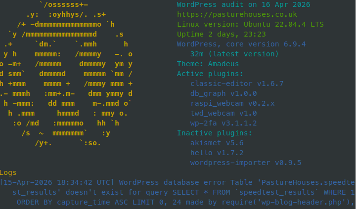
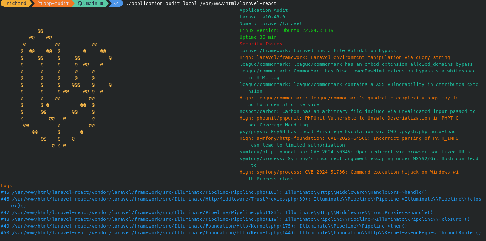
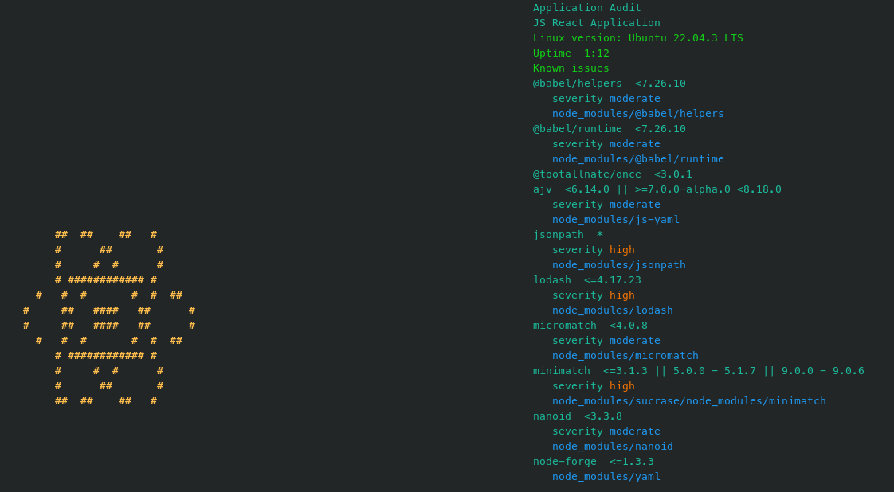

# 📄 Application Audit

## 🌟 Overview

App Audit is a command line PHP application that provides a quick overview of a PHP or JS application,
showing security alerts, out of date components and log lines.

It recognizes WordPress, Laravel and Yii applications and will list WordPress plugins, composer and npm modules and show security updates needed as well as out-of-date components.

It runs on linux systems and works remotely using passwordless SSH, so doesn't need to be installed on a server (although it can analyse local applications too.)
The output can be sent to email as html.

## ℹ️ Getting started

To install you'll need composer (from getcomposer.org)

composer install

## 🚀 Usage instructions

Run app audit from the command line.
The target server needs to be a linux server with passwordless ssh connection.

```bash
./application audit {ssh-target-name}

```


Or you can audit a local app if you're using linux

e.g. An outdated laravel-react starter app

```bash
./application audit local {folder-name}

```


A react app needing some updates



## ℹ️ Requirements

PHP 8.2 or greater
WordPress CLI (https://wp-cli.org/) for WordPress information.

Composer

## License

Open-source software licensed under the MIT license.
